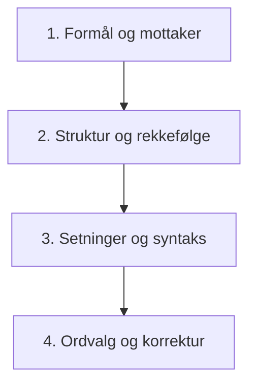

# Klarspråk (norsk) – Veileder og arbeidsmetodikk

Denne ferdigheten er bygget på Språkrådets offisielle retningslinjer for klarspråk ([sprakradet.no/klarsprak](https://sprakradet.no/klarsprak/)), Språklovens § 9 (krav om klart språk i offentlige organer) og den internasjonale standarden for klarspråk (ISO 24495-1).

---

## 1. Hva er klarspråk?

> **Definisjon (Språkrådet & ISO 24495-1):**  
> *Klarspråk er kommunikasjon med så tydelig ordlyd, struktur og visuell utforming at leserne i målgruppen finner informasjonen de trenger, forstår den og kan bruke den.*

Klarspråk handler **ikke** om å fordumme eller fjerne nødvendige faglige nyanser, men om å formidle presist og tilgjengelig uten unødig byråkratisk støy, tåkeprat eller kansellistil.

---

## 2. De fem kjerneprinsippene for klarspråk

### Prinsipp 1: Ha klart for deg hvem du skriver for (Målgruppe)
- **Kjenn mottakeren:** Hvem er den primære leseren? Hvilke forkunnskaper har vedkommende?
- **Tilpass informasjonsnivået:** Forklar begreper leseren ikke forventes å kjenne. Ikke forutsett at leseren har samme faglige eller administrative forutsetninger som deg.
- **Hovedmottaker først:** Hvis teksten har flere mottakere, rett teksten inn mot hovedmottakeren, og legg eventuelt spesialinformasjon i egne vedlegg eller deler.

### Prinsipp 2: Gjør det tydelig hvorfor du skriver (Formål og handling)
- **Kom til poenget tidlig:** Hva skal leseren vite, forstå eller gjøre etter å ha lest teksten?
- **Tydelig handlingsretting:** Hvis mottakeren skal utføre en handling (svare, klage, søke, ta en beslutning, iverksette tiltak), må det fremgå umiddelbart – ikke gjemmes nederst på side to.
- **Fjern overflødig tekst:** Kutt bakgrunnsinformasjon og saksgang som leseren ikke trenger for å ta stilling til saken.

### Prinsipp 3: Lag orden og god struktur (Tekstoppbygging)
- **Det viktigste først (omvendt pyramide):** Start med konklusjonen, vedtaket eller hovedbudskapet.
- **Informativ hovedoverskrift:** Overskriften må fortelle hva saken gjelder og gi mening for leseren.
- **Ett hovedpoeng per avsnitt:** Hold avsnittene passe korte, og plasser dem i en logisk rekkefølge.
- **Gode mellomoverskrifter:** Mellomoverskriftene skal oppsummere avsnittet slik at leseren kan orientere seg kun ved å skumlese.
- **Bruk punktlister:** Gjør vilkår, alternativer eller trinn enkle å overskue ved hjelp av kulepunkter.

### Prinsipp 4: Lag klare setninger (Syntaks og setningsbygning)
- **Korte, enkle setninger:** Si én ting om gangen. Del opp lange perioder med mange leddsetninger og innskudd.
- **Kurer «substantivsyken» (nominaliseringsfellen):** Bruk konkrete verb i stedet for tunge substantiverte handlinger:
  - ❌ *«Det ble foretatt drøfting av saken.»* → ✅ *«Saken ble drøftet.»*
  - ❌ *«Oversending av opplysningene kan ikke finne sted.»* → ✅ *«Opplysningene kan ikke sendes.»*
  - ❌ *«Det har skjedd en standardheving.»* → ✅ *«Standarden er hevet.»*
- **Vær forsiktig med «ved + substantiv»:** Konstruksjoner med *«ved henvendelse»* eller *«ved innvilgelse»* skjuler hvem som gjør hva:
  - ❌ *«Disse fås ved henvendelse til ekspedisjonen.»* → ✅ *«Du får disse hvis du henvender deg til ekspedisjonen.»*
- **Velg aktiv form framfor passiv:**
  - ❌ *«Søknad kan ikke sendes inn etter fristen.»* → ✅ *«Du kan ikke sende inn søknaden etter fristen.»*
  - ❌ *«Det ble fra etatens side besluttet …»* → ✅ *«Etaten besluttet …»*
  - ❌ *«Dette vedtaket kan påklages.»* → ✅ *«Du kan klage på dette vedtaket.»*

### Prinsipp 5: Velg riktige ord og luk ut kansellistil (Vokabular)
- **Bruk moderne ord nær dagligspråket:** Unngå arkaiske, stive byråkratord.
- **Fjern fyllord og floskler:** Kutt unødige fraser som *«i egenskap av»*, *«for så vidt gjelder»*, *«det knytter seg usikkerhet til»*.
- **Forklar fagtermer:** Forklar faguttrykk første gang de forekommer, og forklar med enkle ord (ikke forklar ett vanskelig fagord med et annet).
- **Skriv sammensatte ord riktig:** Unngå engelskinspirert særskriving (*«risiko analyse»* → *«risikoanalyse»*).

---

## 3. Kansellisten – ord og vendinger som bør byttes ut

Språkrådets **kanselliste** samler typiske byråkratiske ord som gjør tekster unødig tunge. Bruk denne erstatningstabellen:

| Prøv å unngå (Kansellistil) | Skriv heller (Klarspråk) |
| :--- | :--- |
| **anbringe** | sette, legge, plassere, feste |
| **anføre** | oppgi, føre opp; påpeke, nevne, hevde |
| **anførsel** | merknad, opplysning, påstand, innvending |
| **angjeldende** | denne, dette, den aktuelle, saken det gjelder |
| **angående** | om (*eller stryk ordet helt*) |
| **anses som** | regnes som, vurderes som |
| **anvendelse (komme til ~)** | bruk; gjelde, bli brukt |
| **avgi (opplysninger)** | gi, oppgi, levere fra seg |
| **avhende / avhending** | selge / salg, overdra |
| **befatning med** | ha noe med saken å gjøre, tilknytning |
| **befordre / befordring** | transportere / transport, frakt |
| **beføye over / beføyelse** | råde over / rettighet, fullmakt |
| **begjære / begjæring** | be om, kreve / krav, anmodning |
| **begunstige** | tilgodese, gi fordeler |
| **beliggende** | som ligger, holder til |
| **besiktige / besiktigelse** | undersøke, kontrollere / undersøkelse, kontroll |
| **besitte / være i besittelse av** | ha, eie, sitte med |
| **beskaffenhet** | type, tilstand, egenart; *«slik saken er»* |
| **beskikke / beskikkelse** | utnevne, oppnevne / utnevning |
| **besørge** | sørge for, ordne, ta hånd om |
| **bevirke** | føre til, forårsake, få i stand |
| **bortta** | fjerne, ta med seg (urettmessig) |
| **erlegge / erleggelse** | betale / betaling |
| **erverve / erverv** | kjøpe, skaffe seg / kjøp, anskaffelse, yrke |
| **etterleve** | følge, rette seg etter |
| **finne å (kunne / ville)** | kunne, ville, finne grunnlag for |
| **forefinnes** | finnes, er, står |
| **foreholde noen noe** | gjøre oppmerksom på, påpeke |
| **foreligge / foreliggende** | finnes, være / denne, dette, den aktuelle |
| **forestå** | lede, stå for, sørge for |
| **forevise** | vise (frem) |
| **forføye over / forføyning** | råde over, bruke / tiltak, vedtak, oppfølging |
| **formentlig** | antakelig, trolig, antatt |
| **forsendelse** | sending, brev, pakke |
| **for så vidt gjelder** | når det gjelder, for |
| **for så vidt som** | fordi, siden, i og med at |
| **fremgå (av)** | stå i, vises av, gå fram av |
| **fremkomme** | komme frem, oppstå, stå i |
| **fullbyrde / fullbyrdelse** | fullføre, sette i verk / iverksetting |
| **ha som/til følge** | føre til, føre med seg |
| **iaktta** | følge, overholde, legge merke til |
| **innvilgelse** | innvilging, godkjenning |
| **med henblikk på** | for å, med tanke på |
| **oppebære** | motta, få |
| **påberope seg** | vise til, henvise til |
| **tilkjennegi** | gi uttrykk for, vise, si |
| **undertegnede** | jeg, vi |
| **vedrørende** | om |

---

## 4. Arbeidsflyt for klarspråksredigering

Når du analyserer eller forbedrer en tekst, følg denne 4-trinns prosessen:

1. **Formål og mottaker:**
   - Hvem er leseren, og hva skal leseren gjøre eller forstå?
   - Kutt bakgrunnsstøy som ikke angår mottakeren.
2. **Struktur og disponering:**
   - Flytt konklusjon og viktigste poeng til toppen.
   - Gi teksten informative overskrifter og logiske avsnitt.
   - Bruk lister og kulepunkter der det er flere vilkår eller punkter.
3. **Setningsnivå:**
   - Kutt setningslengde: maks 20–25 ord i snitt, én hovedtanke per setning.
   - Gjør passive verb aktive (*hvem gjør hva?*).
   - Skriv om nominaliseringer (substantivsyke) til friske verb.
   - Henvend deg direkte til leseren (*«du»* / *«dere»* / *«vi»*).
4. **Ordnivå og språkvask:**
   - Sjekk mot kansellisten og bytt ut tunge arkaismer.
   - Forklar fagtermer enkelt.
   - Sjekk samsvarsbøying, tegnsetting og sammensatte ord.

---

## 5. Sjekkliste for ferdig tekst

Før du leverer eller godkjenner en tekst, sjekk følgende:

- [ ] Er hovedbudskapet plassert i overskriften eller første avsnitt?
- [ ] Forstår leseren umiddelbart hva som forventes av dem?
- [ ] Er språket direkte og henvendende (du-form der det passer)?
- [ ] Er passive setninger omskrevet til aktive der aktøren er kjent?
- [ ] Er tunge substantiveringer (*-ing*, *-else*, *-sjon*) erstattet med verb?
- [ ] Er setningene delt opp så det ikke er lange, innfløkte leddsetninger?
- [ ] Er kansellistilord (*foreligge, angjeldende, tilstille, erlegge*) luket ut?
- [ ] Er faguttrykk forklart på en folkelig og pedagogisk måte?
- [ ] Er sammensatte ord skrevet i ett ord uten særskrivingsfeil?
- [ ] Er teksten korrekturlest for rettskriving, tegnsetting og komma?
